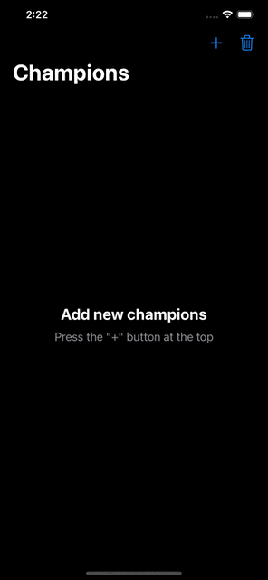

<div align="center">
    <h1>Zed</h1>
    <i>A simple app that shows how to use SwiftUI and CoreData</i>
</div>

<br />

<div align="center">
    <sup>Information</sup>
    <br />
    
    
</div>

---

## Key Features
- SwiftUI + Combine + MVVM
- CoreData abstraction behind a repository
- Riot API

## Screenshot


## Getting Started

### Prerequisites
1. Xcode
2. Riot API [keys](https://developer.riotgames.com/)

### Installation
1. Clone or download the project to your local machine
2. Open and replace `<YOUR RIOT API KEY>` with your own Riot API key in  `RiotRepository.swift`

```swift
final class RiotRepository: RiotRepositoryProtocol {
    let league = LeagueAPI(APIToken: "<YOUR RIOT API KEY>")
    ...
}
```
3. Run the simulator

## To-Do
- [] Update ChampionsRepository to conform to NSFetchResultsController

## Licence
Zed is released under the MIT license. See [LICENSE](./LICENSE) for details.
